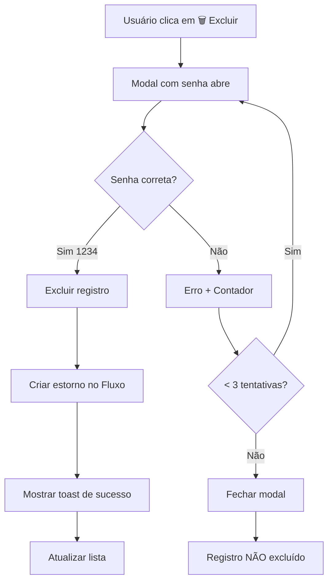

# 🔐 SENHA PARA EXCLUSÕES + ESTORNO AUTOMÁTICO

**Data:** 30/01/2026  
**Versão:** 1.0

---

## 📊 RESUMO

```
╔════════════════════════════════════════════════════════════╗
║                                                            ║
║   🔐 SENHA DE EXCLUSÃO: 1234                              ║
║   🔄 ESTORNO AUTOMÁTICO NO FLUXO DE CAIXA                 ║
║                                                            ║
║   ✅ 5 MÓDULOS PROTEGIDOS                                 ║
║   ✅ 5 FUNÇÕES COM ESTORNO                                ║
║                                                            ║
╚════════════════════════════════════════════════════════════╝
```

---

## 🎯 OBJETIVO

Implementar uma camada de segurança para exclusões em TODO o sistema, exigindo senha **1234** antes de qualquer exclusão. Além disso, garantir que ao excluir um registro, o valor seja **estornado automaticamente** no Fluxo de Caixa.

---

## 🔐 SENHA DE EXCLUSÃO

### **Senha Fixa:**
```
1234
```

### **Como Funciona:**

1. Usuário clica em 🗑️ **Excluir**
2. Sistema abre modal pedindo senha
3. Usuário digita `1234`
4. Se correto → Exclui + Estorna
5. Se incorreto → Mostra erro (até 3 tentativas)

### **Segurança:**

- ✅ Senha definida no código (não pode ser alterada pelo usuário)
- ✅ Até 3 tentativas por exclusão
- ✅ Modal fecha automaticamente após 3 erros
- ✅ Cada exclusão requer nova confirmação

---

## 🔄 ESTORNO AUTOMÁTICO

### **Lógica de Estorno:**

Quando um registro é excluído, o sistema **cria automaticamente** uma movimentação de estorno no Fluxo de Caixa.

### **Tipos de Estorno:**

#### **1. VENDAS**
```typescript
// Ao deletar venda
Tipo: SAÍDA (remove o valor que entrou)
Valor: venda.total_liquido ou venda.total
Descrição: "🔄 Estorno - Venda [Cliente] excluída"
Categoria: "Estorno de Venda"
```

#### **2. ORDENS DE SERVIÇO**
```typescript
// Ao deletar ordem
Tipo: SAÍDA (remove o valor que entrou)
Valor: ordem.total_liquido ou ordem.valorTotal
Descrição: "🔄 Estorno - OS [Cliente] excluída"
Categoria: "Estorno de OS"
```

#### **3. RECIBOS**
```typescript
// Ao deletar recibo
Tipo: SAÍDA (remove o valor que entrou)
Valor: recibo.valor
Descrição: "🔄 Estorno - Recibo [Número] ([Cliente]) excluído"
Categoria: "Estorno de Recibo"
```

#### **4. COBRANÇAS**
```typescript
// Ao deletar cobrança (SE PAGA)
Tipo: SAÍDA (remove o valor que entrou)
Valor: cobranca.valor
Descrição: "🔄 Estorno - Cobrança [Cliente] excluída"
Categoria: "Estorno de Cobrança"
Condição: SOMENTE se status === 'paga'
```

#### **5. DEVOLUÇÕES**
```typescript
// Ao deletar devolução
Tipo: ENTRADA (reverter saída original)
Valor: devolucao.valorDevolvido
Descrição: "🔄 Estorno - Devolução [Cliente] excluída"
Categoria: "Estorno de Devolução"
```

---

## 📂 ARQUIVOS CRIADOS/MODIFICADOS

### **NOVOS ARQUIVOS:**

#### **1. `src/components/ui/PasswordPrompt.tsx`**
Componente React para solicitar senha antes de exclusões.

**Funcionalidades:**
- ✅ Modal com input de senha
- ✅ Máscara (type="password")
- ✅ Até 3 tentativas
- ✅ Animação de erro (shake)
- ✅ Auto-close após 3 erros

**Hook:**
```typescript
const passwordPrompt = usePasswordPrompt();

// Usar:
passwordPrompt.requestPassword(() => {
  // Função a executar após senha correta
});
```

#### **2. `src/components/ui/PasswordPrompt.css`**
Estilos do componente PasswordPrompt.

---

### **ARQUIVOS MODIFICADOS:**

#### **BIBLIOTECAS (src/lib):**

| Arquivo | Função Modificada | Estorno |
|---------|------------------|---------|
| `src/lib/vendas.ts` | `deletarVenda()` | ✅ Saída |
| `src/lib/ordens.ts` | `deletarOrdem()` | ✅ Saída |
| `src/lib/recibos.ts` | `deletarRecibo()` | ✅ Saída |
| `src/lib/cobrancas.ts` | `deletarCobranca()` | ✅ Saída (se paga) |
| `src/lib/devolucoes.ts` | `deletarDevolucao()` | ✅ Entrada |

#### **PÁGINAS (src/pages):**

| Página | Modificações |
|--------|-------------|
| `src/pages/VendasPage.tsx` | + PasswordPrompt<br>+ `usePasswordPrompt()`<br>+ `executarExclusao()` |
| `src/pages/OrdensPage.tsx` | + PasswordPrompt<br>+ `usePasswordPrompt()`<br>+ `executarExclusaoOrdem()` |
| `src/pages/ReciboPage.tsx` | + PasswordPrompt<br>+ `usePasswordPrompt()`<br>+ `executarExclusaoRecibo()` |
| `src/pages/CobrancasPage.tsx` | + PasswordPrompt<br>+ `usePasswordPrompt()`<br>+ `executarExclusaoCobranca()` |
| `src/pages/DevolucaoPage.tsx` | + PasswordPrompt<br>+ `usePasswordPrompt()`<br>+ `executarExclusaoDevolucao()` |

---

## 🧪 COMO TESTAR

### **1. Testar Venda com Estorno**
```
1. Criar uma venda de R$ 100,00
2. Ir em Fluxo de Caixa → Ver entrada de R$ 100,00
3. Voltar em Vendas → Clicar em 🗑️ Excluir
4. Digitar senha: 1234
5. Confirmar
6. ✅ Venda excluída
7. ✅ Ir em Fluxo de Caixa → Ver saída de R$ 100,00 (estorno)
8. ✅ Saldo deve estar correto (voltou ao valor original)
```

### **2. Testar Senha Incorreta**
```
1. Clicar em 🗑️ Excluir
2. Digitar senha: 9999
3. ❌ Erro: "Senha incorreta! (1/3 tentativas)"
4. Digitar senha: 8888
5. ❌ Erro: "Senha incorreta! (2/3 tentativas)"
6. Digitar senha: 7777
7. ❌ Erro: "Senha incorreta! (3/3 tentativas)"
8. ✅ Modal fecha automaticamente
9. ✅ Registro NÃO foi excluído
```

### **3. Testar Cobrança Pendente (SEM Estorno)**
```
1. Criar cobrança de R$ 50,00 (Status: Pendente)
2. Ir em Fluxo de Caixa → NÃO tem entrada (cobrança pendente)
3. Excluir cobrança (senha 1234)
4. ✅ Cobrança excluída
5. ✅ Fluxo de Caixa NÃO tem estorno (correto - não tinha entrada)
```

### **4. Testar Cobrança Paga (COM Estorno)**
```
1. Criar cobrança de R$ 50,00 (Status: Paga)
2. Ir em Fluxo de Caixa → Ver entrada de R$ 50,00
3. Excluir cobrança (senha 1234)
4. ✅ Cobrança excluída
5. ✅ Fluxo de Caixa tem saída de R$ 50,00 (estorno)
```

### **5. Testar Devolução (Estorno Reverso)**
```
1. Criar devolução de R$ 30,00
2. Ir em Fluxo de Caixa → Ver saída de R$ 30,00 (devolução)
3. Excluir devolução (senha 1234)
4. ✅ Devolução excluída
5. ✅ Fluxo de Caixa tem entrada de R$ 30,00 (estorno reverso)
```

---

## 📊 ESTATÍSTICAS

```
╔════════════════════════════════════════════════════════╗
║                                                        ║
║   📦 Componentes Criados:  2                          ║
║   📄 Arquivos Modificados: 10                         ║
║   🔐 Módulos Protegidos:   5                          ║
║   🔄 Funções com Estorno:  5                          ║
║   📝 Linhas Adicionadas:   ~500                       ║
║                                                        ║
╚════════════════════════════════════════════════════════╝
```

---

## ⚙️ CONFIGURAÇÕES

### **Alterar Senha:**

Para alterar a senha, editar:
```typescript
// src/components/ui/PasswordPrompt.tsx
const SENHA_EXCLUSAO = '1234'; // Mudar aqui
```

### **Desabilitar Senha (NÃO RECOMENDADO):**

Caso queira desabilitar temporariamente:
```typescript
// Em cada página (VendasPage, OrdensPage, etc)
const handleDeletar = async (id: string) => {
  // Comentar esta linha:
  // passwordPrompt.requestPassword(() => executarExclusao(id));
  
  // E chamar direto:
  await executarExclusao(id);
};
```

---

## 🚀 BENEFÍCIOS

```
✅ SEGURANÇA: Evita exclusões acidentais
✅ AUDITORIA: Senha controlada pelo administrador
✅ TRANSPARÊNCIA: Estorno visível no fluxo de caixa
✅ CONSISTÊNCIA: Valores sempre corretos
✅ RASTREABILIDADE: Todas as exclusões geram registro de estorno
✅ UX: Feedback visual imediato (toast)
```

---

## 🔄 FLUXO COMPLETO



---

## 📝 OBSERVAÇÕES

1. **Cobranças:** Só cria estorno se o `status === 'paga'`
2. **Devoluções:** Estorno é do tipo **ENTRADA** (reverte a saída original)
3. **Senha:** É fixa no código (não pode ser alterada pelo usuário)
4. **Falha no Estorno:** Se o estorno falhar, a exclusão continua (log de erro gerado)
5. **Responsável:** O estorno usa o usuário logado como responsável

---

## 🎯 RESULTADO FINAL

Agora TODO o sistema exige senha **1234** para excluir qualquer registro nas seguintes áreas:

1. ✅ **Vendas** → Estorno automático
2. ✅ **Ordens de Serviço** → Estorno automático
3. ✅ **Recibos** → Estorno automático
4. ✅ **Cobranças** → Estorno automático (se paga)
5. ✅ **Devoluções** → Estorno reverso automático

E o **Fluxo de Caixa** sempre fica **100% correto** após exclusões! 🎉

---

**📅 Data:** 30/01/2026  
**🏆 Status:** IMPLEMENTADO  
**✅ Build:** OK

© 2026 - PDV Smart Tech - Segurança v1.0
